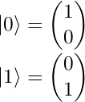
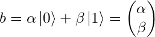

# Qlay (C++) tutorial

## Introduction
Quantum mechanics is an extraordinarily strange, unintuitive yet increasingly accurate description of how reality works at the lowest of levels. The idea that we can take this theory and use it to build an entirely new form of computing is now well-known in popular science, but to study it requires a drastic entry barrier of maths and physics. As a computer scientist/programmer, is it at all possible as of yet to break into the field of quantum programming?

The answer is **yes**. Some basic familiarty with linear algebra (read: do you know what vectors and matrices are?) would do you well, but even without this, let's take a hands-on, no-knowledge-assumed jump into quantum programming using this simulator.

## The quantum bit

The basic unit of classical computing is the *bit* (binary digit). A bit can take either of the values 0 or 1. It cannot take any other values and must take one of those values at any given time.

Let's begin by treating 0 and 1 as vectors. We'll define them as:

The pipe-and-chevron notation is known as a *ket vector*: for our purposes, it simply means a column vector.

0 and 1 are our only two possible states, so |0> and |1> are out *basis vectors*, or *basis states*. We can represent a single bit, *b*, using this system like so:

For a classical bit, either &alpha; is 1 and &beta; is 0, or vice versa: the state is either entirely |0> or entirely |1>.

Simulating our classical bit like this allows us to extend our line of thinking a bit more: what if the state *isn't* entirely |0> or |1>, but somewhere in between? This is the motivation behind the *qubit*: the quantum bit.

A qubit can take almost any values for the coefficients &alpha; and &beta;, creating a mix of states, not quite |0> yet not quite |1>, a blur between the two. The squared magnitude of the coefficient gives the state's probability, i.e. |&alpha;|2 is the chance it will be |0> and |&beta;|2 is the chance it will be |1>. Therefore, these two must sum to 1, as there are no other possibilities.
