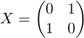
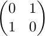
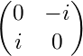
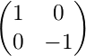
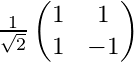
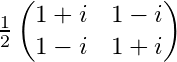
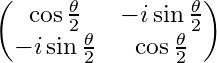
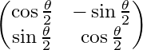
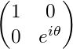

# Qlay (C++) tutorial

* [Introduction](#introduction)
* [The quantum bit](#the-quantum-bit)
* [Coding with one qubit](#coding-with-one-qubit)
  * [Setting up an experiment](#setting-up-an-experiment)
  * [Quantum logic gates](#quantum-logic-gates)
  * [Intricacies of Pauli X and Hadamard](#intricacies-of-pauli-x-and-hadamard)
* [Reference: Quantum logic gates](#reference-quantum-logic-gates)
  * [Measurement](#measurement)
  * [Single-input gates](#single-input-gates)

## Introduction
Quantum mechanics is an extraordinarily strange, unintuitive yet increasingly accurate description of how reality works at the lowest of levels. The idea that we can take this theory and use it to build an entirely new form of computing is now well-known in popular science, but to study it requires a drastic entry barrier of maths and physics. As a computer scientist/programmer, is it at all possible as of yet to break into the field of quantum programming?

The answer is **yes**. Some basic familiarty with linear algebra (read: do you know what vectors and matrices are?) would do you well, but even without this, let's take a hands-on, no-knowledge-assumed jump into quantum programming using this simulator.

## The quantum bit

The basic unit of classical computing is the *bit* (binary digit). A bit can take either of the values 0 or 1. It cannot take any other values and must take one of those values at any given time.

Let's begin by treating 0 and 1 as vectors. We'll define them as:


The pipe-and-chevron notation is known as a *ket vector*: for our purposes, it simply means a column vector.

0 and 1 are our only two possible states, so |0> and |1> are our *basis vectors*, or *basis states*. We can represent a single bit, *b*, using this system like so:


For a classical bit, either *&alpha;* is 1 and *&beta;* is 0, or vice versa: the state is either entirely |0> or entirely |1>.

Simulating our classical bit like this allows us to extend our line of thinking a bit more: what if the state *isn't* entirely |0> or |1>, but somewhere in between? This is the motivation behind the *qubit*: the quantum bit.

A qubit can take almost any values for the coefficients *&alpha;* and *&beta;*, creating a mix of states, not quite |0> yet not quite |1>, a blur between the two. The squared magnitude of the coefficient gives the state's probability, i.e. |*&alpha;*|<sup>2</sup> is the chance it will be |0> and |*&beta;*|<sup>2</sup> is the chance it will be |1>. Therefore, these two must sum to 1, as there are no other possibilities.

## Coding with one qubit
The maths checks out, but how can a qubit possibly be probabilistic in reality? Let's set that aside for one moment: enough with the linear algebra, ahead with the coding.

### Setting up an experiment
First, we'll set up a bareboned Qlay program:

```c++
#include "Qlay.h"
#include <iostream>

using namespace qlay;

int main()
{
    qlay::init();

    return 0;
}
```

We must call `init()` to seed the pseudorandom engine (you can provide a seed as an argument, but leaving it blank defaults to using the current time).

Inside here, let's create a qubit:

```c++
Qubit q;
std::cout << M(q) << std::endl;
```

Our qubit data type does not possess its own value in an accessible way. Instead, we use the `M()` function to measure the qubit, which returns the value as a boolean (true/false, representing |1> and |0>).

The output will be 0: all qubits are initialised into the |0> state.

As mentioned before, this system will reveal itself to be probabilistic. Rather than just doing our experiments once, we should repeat them for statistical results:

```c++
int repeats = 1000;
int zeroes = 0, ones = 0;

for (int i = 0; i < repeats; i++)
{
    Qubit q;

    M(q) ? ones++ : zeroes++;
}

std::cout << "ZERO: " << zeroes << std::endl << "ONE:  " << ones << std::endl;
```

```
ZERO: 1000
ONE:  0
```

We repeat the experiment some suitably large number of times, counting every time the result was 0 and every time it was 1. As expected, it's 0 every time.

### Quantum logic gates
The classical bit doesn't do much by itself: we create programs by manipulating them with logic gates, such as `NOT`, `AND`, `OR` etc. We manipulate the qubit using logic gates, too, but they work rather differently indeed.

The first gate to use is called the *Pauli X gate*. It's a complicated name for a very simple function: it maps |0> to |1> and |1> to |0>. In other words, it's a direct equivalent of the classical `NOT`, or *bit-flip*.

Let's add the `X` gate to our experiment (see [PauliX.cpp](../QlayExamples/PauliX.cpp)):

```c++
Qubit q;
X(q);

M(q) ? ones++ : zeroes++;
```

```
ZERO: 0
ONE:  1000
```

Every single qubit prepared to |0> is |1>. Again, very normal.

A logic gate is actually an operation, represented by a matrix, applied to the qubit vector representation. The matrix for the Pauli X gate is:



Matrix representations will no longer be given here, but are all [provided below](#reference--quantum-logic-gates) for each gate.

Measuring and flipping are the only things we can do with only one bit, classically, but there actually exist numerous quantum logic gates with only one input which don't have classical equivalents. For instance, *Pauli Y* and *Pauli Z* gates also exist, but their effects are subtle and not of interest to us yet.

Instead, the next essential gate to know is the *Hadamard gate*. The easiest way to understand what this gate does is that it performs half a bit-flip. If the input is |0> or |1>, the output will be exactly half-way between |0> and |1>. 

What does this mean in practice? Let's try it out in the same way as before:

```c++
Qubit q;
H(q);

M(q) ? ones++ : zeroes++;
```

```
ZERO: 497
ONE:  503
```

With the qubit set to exactly half-way between |0> and |1>, it has a 50:50 chance of being measured as 0 or 1! This is, clearly, a huge deviation from classical computing and the fundamental motivation behind the qubit, as explained earlier.

The fact that the qubit can exist as as any mixture of the two states is known as ***quantum superposition***. The qubit exists as a *superpostion* of the |0> and |1> basis states. When we observe/measure the qubit, only then does it present itself as one of those basis states, with some probability.

It goes further than even that. Let's extend our experiment so that we simply measure the qubit twice, and also count the number of times both measurements matched (see [Hadamard.cpp](../QlayExamples/Hadamard.cpp)):

```c++
Qubit q;
H(q);

//Basis type is just an alias of bool
Basis result = M(q);
result ? ones++ : zeroes++;

if (M(q) == result)
    matches++;
```

```
ZERO:  536
ONE:   464
MATCH: 1000
```

If the qubit simply had a 50:50 chance of being |0> or |1> when observed, then the number of matches would be around 50% of the time. However, we instead see that the measurements matched 100% of the time.

This means that not only did we get a 50:50 result when first observing the qubit, but the *act of measurement itself* permanently collapsed the qubit into that state. The superpostion has been destroyed and we will now measure the same result every time. This phenomenon is called ***wavefunction collapse*** and goes alongside superposition itself as perhaps the most startling, fundamental of features of quantum mechanics, entering popular science as the *Schr&ouml;dinger's cat paradox*.

### Intricacies of Pauli X and Hadamard
The description of the Hadamard gate's effects as 'half a bit-flip' is a gross simplification, albeit a useful one, but it is hard to understand it more without delving into the underlying linear algebra.

Instead, we will simply note another important property. If you were to apply 'half a bit-flip' twice, you would reasonably expect to get a full bit-flip. Is using two `H` gates equivalent to an `X` gate? Let's find out:

```c++
Qubit q;
H(q);
H(q);

M(q) ? ones++ : zeroes++;
```

```
ZERO: 1000
ONE:  0
```

The answer is **no**. Applying the `H` gate twice gets you right back to where you started, i.e. equals the *identity operation*. The same is, more intuitively, true of the Pauli X (`NOT`) gate (and also Y and Z, for future reference).

Speaking of the `X` gate, it is generalised to flipping all superpositions. In other words, if you had for example a qubit with a 25% chance of |0> and a 75% chance of |1>, applying the `X` gate would yield a 75% chance of |0> and 25% chance of |1> (it simply swaps the values of *&alpha;* and *&beta;*).

## Reference: Quantum logic gates
This section outlines all of the quantum logic gates, explaning them by their operator matrices and effects on a qubit by treating it as a spin state &ndash; understanding their intricacies is not necessarily crucial to start quantum programming. All angles are given in radians.

### Measurement
| Function header | Description |
|:---------------:| ----------- |
| `M(q)` | The 'normal' measurement, returning 0 or 1. Measures the qubit in the Z-axis, i.e. the computational basis.
| `Mx(q)` | Measures the qubit in the X-axis, i.e. the sign basis.

### Single-input gates
| Gate | Function header | Operator matrix | Description |
|:----:|:---------------:| --------------- | ----------- |
| Pauli X | `X(q)` |  | Bit-flip, equivalent to classical `NOT`. Performs a rotation of *&pi;* around the X-axis. Maps \|0> to \|1> and \|1> to \|0>.
| Pauli Y | `Y(q)` |  | Performs a rotation of *&pi;* around the Y-axis. Maps \|0> to *i*\|1> and \|1> to &minus;*i*\|0>.
| Pauli Z | `Z(q)` |  | Phase-flip. Performs a rotation of *&pi;* around the Z-axis. Leaves \|0> unchanged and maps \|1> to &minus;\|1>.
| Hadamard | `H(q)` |  | Creates a superposition by mapping \|0> to (\|0>&plus;\|1>)/sqrt(2) and \|1> to (\|0>&minus;\|1>)/sqrt(2). Performs a rotation of *&pi;* around the X-axis followed by *&pi;*/2 around the Y-axis.
| Square root NOT | `SRNOT(q)` |  | Square root of the Pauli X gate. Appling two in sequence is thus equivalent to a single `NOT`.
| X rotation | `Rx(angle, q)` |  | Rotates around the X-axis by the given angle.
| Y rotation | `Ry(angle, q)` |  | Rotates around the Y-axis by the given angle.
| Z rotation | `Rz(angle, q)` |  | Rotates around the Z-axis by the given angle.
| Phase shift | `Rp(angle, q)` |  | Performs a phase shift by the given angle, mapping \|1> to exp(*i&theta;*)\|1>.
