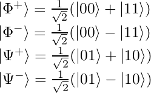
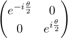

# Qlay (C++) tutorial

* [Introduction](#introduction)
* [The quantum bit](#the-quantum-bit)
* [Coding with one qubit](#coding-with-one-qubit)
  * [Setting up an experiment](#setting-up-an-experiment)
  * [Quantum logic gates](#quantum-logic-gates)
  * [Intricacies of Pauli X and Hadamard](#intricacies-of-pauli-x-and-hadamard)
* [Coding with two qubits](#coding-with-two-qubits)
  * [Quantum entanglement](#quantum-entanglement)
  * [Nonlocal games](#nonlocal-games)
  * [Superdense coding](#superdense-coding)
  * [Teleportation](#teleportation)
* [Quantum computation](#quantum-computation)
  * [Representing functions](#representing-functions)
  * [Deutsch-Jozsa algorithm](#deutsch-jozsa-algorithm)
* [Reference: Quantum logic gates](#reference-quantum-logic-gates)
  * [Measurement](#measurement)
  * [Single-input gates](#single-input-gates)

## Introduction
Quantum mechanics is an extraordinarily strange, unintuitive yet increasingly accurate description of how reality works at the lowest of levels. The idea that we can take this theory and use it to build an entirely new form of computing is now well-known in popular science, but to study it requires a drastic entry barrier of maths and physics. As a computer scientist/programmer, is it at all possible as of yet to break into the field of quantum programming?

The answer is **yes**. Some basic familiarty with linear algebra (read: do you know what vectors and matrices are?) would do you well, but even without this, let's take a hands-on, no-knowledge-assumed jump into quantum programming using this simulator.

This tutorial contains all examples in both C++ and the C# equivalent. Later examples may omit C# equivalents for sanity, because they are identical outside of syntax. To use Qlay in C++, link against Qlay.lib and include Qlay.h, making sure to have Qlay.dll available. To use Qlay in C#, reference both Qlay.dll and QlayCLI.dll &ndash; as the former is unmanaged, you should (in Visual Studio) manually add it as a project file and set it to copy to output in its properties.

The CLI interface is almost identical, except that standalone functions are contained in the `Core` static class, with the exception of logic gates, which are contained in `Gates`.

## The quantum bit

The basic unit of classical computing is the *bit* (binary digit). A bit can take either of the values 0 or 1. It cannot take any other values and must take one of those values at any given time.

Let's begin by treating 0 and 1 as vectors. We'll define them as:


The pipe-and-chevron notation is known as a *ket vector*: for our purposes, it simply means a column vector.

0 and 1 are our only two possible states, so |0> and |1> are our *basis vectors*, or *basis states*. We can represent a single bit, *b*, using this system like so:


For a classical bit, either *&alpha;* is 1 and *&beta;* is 0, or vice versa: the state is either entirely |0> or entirely |1>.

Simulating our classical bit like this allows us to extend our line of thinking a bit more: what if the state *isn't* entirely |0> or |1>, but somewhere in between? This is the motivation behind the *qubit*: the quantum bit.

A qubit can take almost any values for the coefficients *&alpha;* and *&beta;*, creating a mix of states, not quite |0> yet not quite |1>, a blur between the two. The squared magnitude of the coefficient gives the state's probability, i.e. |*&alpha;*|<sup>2</sup> is the chance it will be |0> and |*&beta;*|<sup>2</sup> is the chance it will be |1>. Therefore, these two must sum to 1, as there are no other possibilities.

## Coding with one qubit
The maths checks out, but how can a qubit possibly be probabilistic in reality? Let's set that aside for one moment: enough with the linear algebra, ahead with the coding.

### Setting up an experiment
First, we'll set up a bareboned Qlay program:

**C++:**
```c++
#include "Qlay.h"
#include <iostream>

using namespace qlay;

int main()
{
    qlay::init();

    return 0;
}
```
**C#:**
```csharp
using qlay.cli;

namespace QlayTest
{
    class Program
    {
        static void Main(string[] args)
        {
            Core.init();
        }
    }
}
```

We must call `init()` to seed the pseudorandom engine (you can provide a seed as an argument, but leaving it blank defaults to using the current time).

Inside here, let's create a qubit:

**C++:**
```c++
QubitSystem qs;
Qubit q(qs);
std::cout << M(q) << std::endl;
```
**C#:**
```csharp
//Managed Qubit is IDisposable
using (QubitSystem qs = new QubitSystem())
using (Qubit q = new Qubit(qs))
{
    bool result = Gates.M(q);

    //Render as 0 or 1
    Console.WriteLine(result ? 1 : 0);
}
```

We first instantiate a qubit system, which all qubits must be instantiated in relation to. Our qubit data type does not possess its own value in an accessible way. Instead, we use the `M()` function to measure the qubit, which returns the value as a boolean (true/false, representing |1> and |0>).

The output will be 0: all qubits are initialised into the |0> state.

As mentioned before, this system will reveal itself to be probabilistic. Rather than just doing our experiments once, we should repeat them for statistical results:

**C++:**
```c++
int repeats = 1000;
int zeroes = 0, ones = 0;

for (int i = 0; i < repeats; i++)
{
    QubitSystem qs;
    Qubit q(qs);

    M(q) ? ones++ : zeroes++;
}

std::cout << "ZERO: " << zeroes << std::endl << "ONE:  " << ones << std::endl;
```
**C#:**
```csharp
int repeats = 1000;
int zeroes = 0, ones = 0;

for (int i = 0; i < repeats; i++)
{
    using (QubitSystem qs = new QubitSystem())
    using (Qubit q = new Qubit(qs))
    {
        if (Gates.M(q)) ones++;
        else zeroes++;
    }
}

Console.WriteLine("ZERO: " + zeroes);
Console.WriteLine("ONE:  " + ones);
```
**Output:**
```
ZERO: 1000
ONE:  0
```

We repeat the experiment some suitably large number of times, counting every time the result was 0 and every time it was 1. As expected, it's 0 every time.

### Quantum logic gates
The classical bit doesn't do much by itself: we create programs by manipulating them with logic gates, such as `NOT`, `AND`, `OR` etc. We manipulate the qubit using logic gates, too, but they work rather differently indeed.

The first gate to use is called the *Pauli X gate*. It's a complicated name for a very simple function: it maps |0> to |1> and |1> to |0>. In other words, it's a direct equivalent of the classical `NOT`, or *bit-flip*.

Let's add the `X` gate to our experiment (see [PauliX.cpp](../QlayExamples/PauliX.cpp)):

**C++:**
```c++
QubitSystem qs;
Qubit q(qs);
X(q);

M(q) ? ones++ : zeroes++;
```
**C#:**
```csharp
using (QubitSystem qs = new QubitSystem())
using (Qubit q = new Qubit(qs))
{
    Gates.X(q);

    if (Gates.M(q)) ones++;
    else zeroes++;
}
```
**Output:**
```
ZERO: 0
ONE:  1000
```

Every single qubit prepared to |0> is |1>. Again, very normal.

A logic gate is actually an operation, represented by a matrix, applied to the qubit vector representation. The matrix for the Pauli X gate is:


Matrix representations will no longer be given here, but are all [provided below](#reference--quantum-logic-gates) for each gate.

Measuring and flipping are the only things we can do with only one bit, classically, but there actually exist numerous quantum logic gates with only one input which don't have classical equivalents. For instance, *Pauli Y* and *Pauli Z* gates also exist, but their effects are subtle and not of interest to us yet.

Instead, the next essential gate to know is the *Hadamard gate*. The easiest way to understand what this gate does is that it performs half a bit-flip. If the input is |0> or |1>, the output will be exactly half-way between |0> and |1>. 

What does this mean in practice? Let's try it out in the same way as before:

**C++:**
```c++
QubitSystem qs;
Qubit q(qs);
H(q);

M(q) ? ones++ : zeroes++;
```
**C#:**
```csharp
using (QubitSystem qs = new QubitSystem())
using (Qubit q = new Qubit(qs))
{
    Gates.H(q);

    if (Gates.M(q)) ones++;
    else zeroes++;
}
```
**Output:**
```
ZERO: 497
ONE:  503
```

With the qubit set to exactly half-way between |0> and |1>, it has a 50:50 chance of being measured as 0 or 1! This is, clearly, a huge deviation from classical computing and the fundamental motivation behind the qubit, as explained earlier.

The fact that the qubit can exist as as any mixture of the two states is known as ***quantum superposition***. The qubit exists as a *superpostion* of the |0> and |1> basis states. When we observe/measure the qubit, only then does it present itself as one of those basis states, with some probability.

It goes further than even that. Let's extend our experiment so that we simply measure the qubit twice, and also count the number of times both measurements matched (see [Hadamard.cpp](../QlayExamples/Hadamard.cpp)):

**C++:**
```c++
QubitSystem qs;
Qubit q(qs);
H(q);

//Basis type is just an alias of bool
Basis result = M(q);
result ? ones++ : zeroes++;

if (M(q) == result)
    matches++;
```
**C#:**
```csharp
using (QubitSystem qs = new QubitSystem())
using (Qubit q = new Qubit(qs))
{
    Gates.H(q);

    bool result = Gates.M(q);
    if (result) ones++;
    else zeroes++;

    if (Gates.M(q) == result)
    matches++;
}
```
**Output:**
```
ZERO:  536
ONE:   464
MATCH: 1000
```

If the qubit simply had a 50:50 chance of being |0> or |1> when observed, then the number of matches would be around 50% of the time. However, we instead see that the measurements matched 100% of the time.

This means that not only did we get a 50:50 result when first observing the qubit, but the *act of measurement itself* permanently collapsed the qubit into that state. The superpostion has been destroyed and we will now measure the same result every time. This phenomenon is called ***wavefunction collapse*** and goes alongside superposition itself as perhaps the most startling, fundamental of features of quantum mechanics, entering popular science as the *Schr&ouml;dinger's cat paradox*.

### Intricacies of Pauli X and Hadamard
The description of the Hadamard gate's effects as 'half a bit-flip' is a gross simplification, albeit a useful one, but it is hard to understand it more without delving into the underlying linear algebra.

Instead, we will simply note another important property. If you were to apply 'half a bit-flip' twice, you would reasonably expect to get a full bit-flip. Is using two `H` gates equivalent to an `X` gate? Let's find out:

**C++:**
```c++
QubitSystem qs;
Qubit q(qs);
H(q);
H(q);

M(q) ? ones++ : zeroes++;
```
**C#:**
```csharp
using (QubitSystem qs = new QubitSystem())
using (Qubit q = new Qubit(qs))
{
    Gates.H(q);
    Gates.H(q);

    if (Gates.M(q)) ones++;
    else zeroes++;
}
```
**Output:**
```
ZERO: 1000
ONE:  0
```

The answer is **no**. Applying the `H` gate twice gets you right back to where you started, i.e. equals the *identity operation*. The same is, more intuitively, true of the Pauli X (`NOT`) gate (and also Y and Z, for future reference).

Speaking of the `X` gate, it is generalised to flipping all superpositions. In other words, if you had for example a qubit with a 25% chance of |0> and a 75% chance of |1>, applying the `X` gate would yield a 75% chance of |0> and 25% chance of |1> (it simply swaps the values of *&alpha;* and *&beta;*).

Finally, it is important to appreciate that a qubit can be treated as a direction vector in 3-dimensional Euclidian space, i.e. as a sphere of which the surface area maps the 2-dimensional Hilbert space (*Bloch sphere*). The Z-axis is treated by convention as the computational basis -- a qubit pointing directly along the Z-axis is |0>, whilst a qubit pointing directly against the Z-axis is |1>. One way of preparing a qubit with some probability *p* of |1> is by applying a Y-axis rotation to the default |0> qubit of 2*arcsin(sqrt(*p*)). Try deriving this from the operator matrix for the `Ry` gate in the reference section below!

## Coding with two qubits
We've seen that superposition is a key aspect of qubits. Although we can do more with a qubit than a classical bit, we still can't exactly do much with just one. The true power of quantum computing only becomes clear when we move onto using more than one qubit and the other key aspect of their behaviour: ***entanglement***.

### Quantum entanglement
First, let's look at probably the most straightforward of the logic gates which take two qubits as inputs: the `SWAP` gate.

**C++:**
```c++
QubitSystem qs;
Qubit q0(qs); Qubit q1(qs);
X(q0);
std::cout << "q0: " << M(q0) << std::endl;
std::cout << "q1: " << M(q1) << std::endl;

SWAP(q0, q1);
std::cout << "q0: " << M(q0) << std::endl;
std::cout << "q1: " << M(q1) << std::endl;
```
**C#:**
```csharp
using (QubitSystem qs = new QubitSystem())
using (Qubit q0 = new Qubit(qs))
using (Qubit q1 = new Qubit(qs))
{
    Gates.X(q0);
    Console.WriteLine("q0: " + (Gates.M(q0) ? 1 : 0));
    Console.WriteLine("q1: " + (Gates.M(q1) ? 1 : 0));

    Gates.SWAP(q0, q1);
    Console.WriteLine("q0: " + (Gates.M(q0) ? 1 : 0));
    Console.WriteLine("q1: " + (Gates.M(q1) ? 1 : 0));
}
```
**Output:**
```
q0: 1
q1: 0
q0: 0
q1: 1
```

This above example instantiates two qubits, *q<sub>0</sub>* and *q<sub>1</sub>*, and flips *q<sub>0</sub>* to |1>. This is confirmed by measurement. The `SWAP` gate is then applied, which does exactly what it says on the tin: the two qubits are swapped with each other in their entirety. Following this, *q<sub>0</sub>* now measures |0> and *q<sub>1</sub>* now |1>. The values for *&alpha;* and *&beta;* for *q<sub>0</sub>* are swapped in-place with those for *q<sub>1</sub>*.

The `SWAP` gate is of fundamental importance for low-level implementations, but we'll turn to a more interesting gate for the behaviour of interacting qubits. The controlled-NOT (`CNOT`) gate applies the `X` gate to a target qubit if an only if a control qubit measures |1> &ndash; otherwise, no change occurs. The truth table for a two-qubit system |*control*,*target*> is as follows:

| before | after |
|:------:|:-----:|
| \|00> | \|00> |
| \|01> | \|01> |
| \|10> | \|11> |
| \|11> | \|10> |

The control qubit is never affected, and the target qubit is only affected conditionally on the control. We can use this gate to demonstrate logical interaction between qubits (see [entanglement.cpp](../QlayExamples/entanglement.cpp)):

**C++:**
```c++
QubitSystem qs;
Qubit q0(qs); Qubit q1(qs);
H(q0);
CNOT(q0, q1);

Basis result = M(q0);
result ? ones++ : zeroes++;

if (M(q1) == result)
    matches++;
```
**C#:**
```csharp
using (QubitSystem qs = new QubitSystem())
using (Qubit q0 = new Qubit(qs))
using (Qubit q1 = new Qubit(qs))
{
    Gates.H(q0);
    Gates.CNOT(q0, q1);

    bool result = Gates.M(q0);
    if (result) ones++;
    else zeroes++;

    if (Gates.M(q1) == result)
        matches++;
}
```
**Output:**
```
ZERO:  502
ONE:   498
MATCH: 1000
```

First, we apply the Hadamard gate to *q<sub>0</sub>*, so it is in an equal superposition of |0> and |1>. Then, we use it as the control to `CNOT` on *q<sub>1</sub>*. Therefore, *q<sub>1</sub>* now also has a 50:50 probability between |0> and |1>. Critically, we count the number of times the measurement of *q<sub>0</sub>* equals *q<sub>1</sub>* and obtain 100%.

If *q<sub>1</sub>* simply also had a 50:50 probability then we would expect it to only match approximately 50% of the time. The true situation is that the very act of measuring and thus collapsing *q<sub>0</sub>* collapses *q<sub>1</sub>* before it is itself measured. There is seemingly 'spooky action at a distance': the two qubits interacted at some point in the past (`CNOT`) and they are now *entangled*, such that measuring one has a very real effect upon the other.

When qubits are entangled, they cannot simply be considered as independent, 2-dimensional vectors. Instead, the entire system is a 4-dimensional vector space; a linear combination of all possible states, which are |00>, |01, |10> and |11> as given in the truth table above. In this case, the *entire system* is in an equal superposition of |00> and |11>, and measuring one qubit collapses the system as a whole.

This simple example, though the most common and standard way of entagling two qubits, does not actually appear to transcend classical conditional probability, however. The true power lies in quantum algorithms and communication which exploits entanglement in ways which cannot be replicated or explained classically.

### Nonlocal games
Quantum nonlocality, the idea that states are not just subject to local realism, can be demonstrated through *nonlocal games*, experiments designed to exploit entanglement and prove quantum 'superiority'.

Consider a referee in a game and two co-operative players, *Alice* and *Bob*. The game consists of Alice and Bob each receiving a 'question' from the referee, which is just a classical bit 0 or 1, and them responding with an 'answer', likewise 0 or 1. They win the game if and only if their answers satisfy some logical predicate with the questions. The kicker is that they *cannot communicate* with each other, outside of agreeing upon a strategy beforehand.

The CHSH game consists of Alice and Bob receiving the questions *r* and *s* respectively, where both are 0 or 1 with 50:50 chance. They win if their answers *a* and *b* satisfy the predicate *r* AND *s* = *a* XOR *b*.

In other words, if *r* and *s* are both 1 then *a* and *b* must be different; otherwise, they must be the same. These winning conditions can be visualised in a truth table:

| *r* AND *s* | *a* XOR *b* |
|:---:|:---:|
| 0 AND 0 | 0 |
| 0 AND 1 | 0 |
| 1 AND 0 | 0 |
| 1 AND 1 | 1 |

Classically, the best possible strategy is trivial to determine. If Alice and Bob both give the same answers, they have a 3-in-4 chance of winning: they only lose in the 1 AND 1 case. So, Alice and Bob decide to both give the answer 0 and cannot win more assuredly than this.

However, if Alice and Bob each possess entangled qubits, they can 'cheat' the system, being able to communicate with each other to an extent despite no classical channel existing between them.

The trick is to perform measurement on the qubit(s) in particular bases. Normal measurement so far has been respect to the Z-axis: the computational basis. One can measure a qubit in any axis you want, which collapses the qubit onto that basis. We sometimes call the X-axis basis the *sign basis*. After applying Hadamard gate to |0>, you cannot say whether it will collapse to |0> or |1>, but you can say for certainty that it is in the |+> state. Likewise, a qubit prepared as |0> has a 50:50 chance of being measured to be |+> or |->, by instead measuring in the X-axis.

An `Mx` function is provided as shorthand for measuring in the X-axis, but you can measure in any arbitrary axis *A* by applying rotation gates that map *A* onto the Z-axis, and then just measuring in the Z-axis with `M`.

Alice and Bob would ideally like to communicate the question they received to the other. The best they can achieve is to measure their entangled qubits in different axes depending on the question they received, in such a way that the results (taken as their answers *a* and *b*) have the highest probability of falling into a winning condition. The derivation of the optimal strategy and axes to measure in is beyond this scope, but see [CHSH.cpp](../QlayExamples/CHSH.cpp) for it implemented and performed. The optimal strategy is that Alice measures in the X axis if *r* is 1 and in the Z axis otherwise, and Bob measures in the same but rotated &pi;/8 radians. The results as shown are conclusive: the classical strategy's success rate is 75%, but the quantum strategy's is ~85%!

The GHZ game (see [GHZ.cpp](../QlayExamples/GHZ.cpp)) is very similar, but introduces a third player, *Charlie*, changes the predicate and restricts the possible set of questions they receive. The best classical success rate is again 75%. By sharing three entangled qubits prepared to a state correspending to the possible set of questions, a simpler quantum strategy of applying the Hadamard gate once achieves something spectacular: a 100% success rate.

These games prove that quantum entanglement transcends mere conditional probability: that entangled states cannot be considered in isolation and can be dependent even when physically separated.

### Superdense coding
Entanglement allows for extremely powerful techniques in communication, of which there's two major ones we'll look at. The first is ***superdense coding***, wherein we can transmit two classical bits of information by transmitting only one qubit.

We mentioned earlier that the most basic way of creating an entangled state is by applying a `H` gate followed by a `CNOT`. This actually creates one of the four most simple and maximally entangled states possible between two qubits: one of the four *Bell states*. These are as follows:



Applying `H` then `CNOT` creates the first Bell state (|&Phi;<sup>+</sup>>). The two &Phi; states are where the two qubits are equal and the two &Psi; states are where they are different. Between each of the states of these types, the superscript sign indicates the phase factor. Remember, this phase factor does not directly affect the probability amplitudes, but are distinguishable when applying other operations.

The problem at hand is that Alice wishes to send two classical bits of information to Bob, by transmitting only one qubit. A simple insight is that there are four possible states she could wish to send: 00, 01, 10 or 11. The overall idea is thus straightforward: if Alice and Bob share an entangled state, Alice can transform the Bell state (encoding her message) such that Bob can determine the transformation made (decoding her message).

First, Alice and Bob receive a qubit each, consituting the first Bell state (|&Phi;<sup>+</sup>>):

**C++:**
```c++
QubitSystem qs;
Qubit qa(qs); Qubit qb(qs);

//Prepare Alice's and Bob's qubits in Bell state |Φ+>
H(qa);
CNOT(qa, qb);

//Bob 'undoes' the entanglement
CNOT(qa, qb);
H(qa);

std::cout << "Message received: " << M(qa) << M(qb) << std::endl;
```
**Output:**
```
Message received: 00
```

So far, Alice receives *q<sub>a</sub>* and Bob receives *q<sub>b</sub>*. Alice currently does nothing and sends *q<sub>a</sub>* to Bob. Bob decodes by applying `CNOT` then `H`, 'undoing' the entanglement. It is clear that Bob just returns the state to its initial preparation (|00>) by symmetry, because you should remember that all gates are reversible.

If Alice intends to transmit the message 00, then this is already achieved. If she intends to transmit a different message, then she should transform the state into a different Bell state, by applying a certain operation(s) to *q<sub>a</sub>* before sending it, as below:

| Message | Target state | Operation(s) |
|:-------:|:------------:|:------------:|
| 00 | \|&Phi;<sup>+</sup>> | none |
| 01 | \|&Psi;<sup>+</sup>> | `X` |
| 10 | \|&Phi;<sup>-</sup>> | `Z` |
| 11 | \|&Psi;<sup>-</sup>> | `X` then `Z` |

We can try each of these cases to confirm they send the intended message correctly (see [superdense_coding.cpp](../QlayExamples/superdense_coding.cpp)):

**C++:**
```c++
QubitSystem qs;
Qubit qa(qs); Qubit qb(qs);

//Prepare Alice's and Bob's qubits in Bell state |Φ+>
H(qa);
CNOT(qa, qb);

//If sending 00, do nothing

//If sending 01, transform into |Ψ+>
//X(qa);

//If sending 10, transform into |Φ->
//Z(qa);

//If sending 11, transform into |Ψ->
//X(qa);
//Z(qa);

//Bob 'undoes' the entanglement
CNOT(qa, qb);
H(qa);

std::cout << "Message received: " << M(qa) << M(qb) << std::endl;
```

When working through examples and trying to understand the motivations and reasonings, it can be most useful to view the entire quantum state at specific points as a column vector. The `QubitSystem` object can just be streamed to standard output. This is, naturally, a debugging feature as a benefit of a simulation: the key principle is that true quantum systems collapse as a result of observation.

### Teleportation
Another major technique in quantum communication is the spiritual inverse to superdense coding: transmitting one qubit in its entirety, with the support of classical bit communication. Alice can 'teleport' the information of one qubit by sending just two classical bits to Bob, assuming again that they can pre-share an entangled state.

First, let's have Alice possess some qubit *q<sub>c</sub>*, which is the information that she wants to transmit to Bob:

**C++:**
```c++
QubitSystem qs;
Qubit qc(qs);

//Prepare Alice's qubit with 75% chance of |1>, to teleport
//r|0>+s|1> (where |s|^2 = 0.75)
Ry(2 * asin(sqrt(0.75)), qc);

M(qc) ? ones++ : zeroes++;
```
**Output:**
```
ZERO:  255
ONE:   745
```

For demonstration purposes, we want this qubit to be very distinctive (perhaps not just, say, the rather common 50:50), so the above Y-axis rotation prepares a qubit with a 75% chance of measuring |1>.

We want Bob to possess a qubit *q<sub>b</sub>* which becomes an exact copy of *q<sub>c</sub>*. First, if we perform a `CNOT(qc, qb)`, this only achieves an entangled system in which the observed value of *q<sub>b</sub>* will match the observed value of *q<sub>c</sub>*. We want *q<sub>b</sub>* to truly become the standalone state *r*|0>+*s*|1> of Alice's qubit!

Instead, after performing the `CNOT`, Alice could measure in the sign (X) basis, obtaining either |+> or |->. This leaves *q<sub>b</sub>* as either *r*|0>+*s*|1> or *r*|0>-*s*|1>, respectively. Alice should let Bob know if she measured |->, so that he knows whether or not to perform a phase correction of a `Z` gate, flipping that minus sign.

**C++:**
```c++
QubitSystem qs;
Qubit qb(qs); Qubit qc(qs);

//Prepare Alice's qubit with 75% chance of |1>, to teleport
//r|0>+s|1> (where |s|^2 = 0.75)
Ry(2 * asin(sqrt(0.75)), qc);

//Copies Alice's measurement to Bob...
//Doesn't give Bob the state r|0>+s|1> !
CNOT(qc, qb);

//Alice measures in the sign basis, as either |+> or |->
Basis result = Mx(qc);

//Bob's qubit is now either r|0>+s|1> or r|0>-s|1>
//In the latter case, correct the phase
if (result) Z(qb);

M(qb) ? ones++ : zeroes++;
```
**Output:**
```
ZERO:  240
ONE:   760
```

We now have a procedure for 'copying' Alice's qubit onto Bob's. Note that the term 'copy' is misleading here: Alice's original information is destroyed, being moved onto Bob's qubit. This is a fundamental restriction in quantum information called the *no-cloning theorem*.

Alice currently classically communicates only one bit to Bob, letting him know if he must perform a phase correction. However, we aren't done yet, as we are still relying on an actual `CNOT` gate: the idea is to transmit the qubit from afar. The next step is to effectively turn this into a 'remote' `CNOT` by further exploiting entanglement, so &ndash; similarly to superdense coding &ndash; we must first provide Alice and Bob with an entangled state. We can use any of the aforementioned Bell states, so let's just again go with the most common |&Phi;<sup>+</sup>>.

Alice adds her data qubit into the entanglement channel by performing `CNOT(qc, qa)`, where *q<sub>a</sub>* is her qubit given in a Bell state with Bob's *q<sub>b</sub>*. She then performs two measurements. One is the same as before: measuring her data qubit in the sign basis, to let Bob know if he must perform a phase correction. The additional one that must know be performed is a normal (computational basis) measurement of the Bell qubit. If she measures |1>, then Bob's qubit will be bit-flipped, so she must let Bob know if he needs to flip it back with an `X` gate (see [teleportation.cpp](../QlayExamples/teleportation.cpp)):

**C++:**
```c++
QubitSystem qs;
Qubit qa(qs); Qubit qb(qs); Qubit qc(qs);

//Prepare Alice's qubit with 75% chance of |1>, to teleport
//r|0>+s|1> (where |s|^2 = 0.75)
Ry(2 * asin(sqrt(0.75)), qc);

//Give Alice and Bob the Bell state |Φ+>
H(qa);
CNOT(qa, qb);

//Alice entangles her data qubit with her Bell qubit
CNOT(qc, qa);

//Alice measures her data qubit in the sign basis
Basis correct_phase = Mx(qc);

//Alice measures her Bell qubit in the computational basis
Basis correct_flip = M(qa);


//Bob's qubit may have flipped, so correct if necessary
if (correct_flip) X(qb);

//Bob's qubit is now either r|0>+s|1> or r|0>-s|1>
//In the latter case, correct the phase
if (correct_phase) Z(qb);

M(qb) ? ones++ : zeroes++;
```
**Output:**
```
ZERO:  250
ONE:   750
```

This finished example now successfully teleports one qubit from Alice to Bob, with only a pre-shared entangled state, and two bits sent classically.

## Quantum computation
So far, we have looked mainly at examples of quantum 'superiority' in communication, rather than computation. Perhaps the most famous example of a quantum algorithm is *Shor's algorithm* for factorising integers almost exponentially faster than the best known classical method, prompting much of the subsequent research into quantum computing and post-quantum cryptography. This particular algorithm is out of scope for this guide, but let's look at more straightforward examples that constitute a good introduction to quantum programming.

### Representing functions
First, let's clarify how we can represent functions with qubits. We will just consider functions with a single input number, *x*. What we mean by a number here is, of course, a string of bits. Let's consider a 3-bit number: *x<sub>2</sub>x<sub>1</sub>x<sub>0</sub>*. We simply represent this with three qubits.

We'll also just consider functions that, taking an *n*-bit number, return a single bit. In other words, our functions are some predicate on a number returning true or false. We call a quantum implementation of a function *f* an *oracle*, denoted *U<sub>f</sub>*, as the idea is that it can be treated as a black box.

A simple example for a function *f*(*x*) is if *x* is an odd number. Due to the binary representation, this is just 1 (true) if the least-significant digit *x<sub>0</sub>* is 1, and 0 (false) if it is 0.

One way of representing the oracle is in a form herein called an *output oracle*. We use a fourth qubit, *y*, which the oracle stores the result in. The beauty of quantum simulation is that we can consider the entire function domain at once through superposition:

**C++:**
```c++
QubitSystem qs;
Qubit x0(qs), x1(qs), x2(qs), y(qs);

//Create uniform superposition of function domain
H(x0);
H(x1);
H(x2);

//Output Oracle: Number is odd (least significant digit is 1)
//Maps |x>|y> to |x>|y XOR f(x)>
CNOT(x0, y);

std::cout << qs << std::endl;
```
**Output:**
```
|0000> 0.353553
|0001> 0
|0010> 0.353553
|0011> 0
|0100> 0.353553
|0101> 0
|0110> 0.353553
|0111> 0
|1000> 0
|1001> 0.353553
|1010> 0
|1011> 0.353553
|1100> 0
|1101> 0.353553
|1110> 0
|1111> 0.353553
```

The three digits on the right constitute the input *x<sub>2</sub>x<sub>1</sub>x<sub>0</sub>* and the leftmost digit is the result *y*. For all inputs with the rightmost digit 1, *y* is correctly 1: they are odd. We just measure *y* to obtain the result of the function.

There is a second major way of encoding functions which does not require an additional output qubit(s). Instead, the output is encoded directly into the input qubits by altering their phase. This is herein called the *phase oracle*:

**C++:**
```c++
QubitSystem qs;
Qubit x0(qs), x1(qs), x2(qs);

//Create uniform superposition of function domain
H(x0);
H(x1);
H(x2);

//Phase Oracle: Number is odd (least significant digit is 1)
//Flips phase on states matching predicate
Z(x0);

std::cout << qs << std::endl;
```
**Output:**
```
|000> 0.353553
|001> -0.353553
|010> 0.353553
|011> -0.353553
|100> 0.353553
|101> -0.353553
|110> 0.353553
|111> -0.353553
```

We can see that instead of setting an external 'flag' qubit in the case of a 1 output, we phase-flip in the case of a 1 output. This is done very easily with the `Z` gate, which leaves |0> alone but maps |1> to -|1>. Although this reduces the memory cost, you may realise that it doesn't appear to be useful, as relative phase factor is not experimentally determinable just by measuring the qubits. However, we also know that relative phase factor does affect how states react to further operations, so this representation can come in very handy for algorithms using the function.

### Deutsch-Jozsa algorithm
Let's consider a situation in which we are promised that a function *f*(*x*) is either ***constant*** or ***balanced***. If it is constant, then it always outputs the same value, i.e. either 0 or 1. If it is balanced, then it outputs 0 for exactly half of the input domain, and 1 for the other half. Our task is to decide which of these a given function is.

Our above example of a number being odd is balanced, because exactly half of the numbers in the domain are odd.

Classically, we must continually test *f*(*x*) for different *x*. In the worst case, we must test just over half of the domain, because we can only be sure the function is constant if the same output is observed for more than half; as soon as we see a different output, we can conclude that it is balanced. So, if the input has *n* bits, then the worst case is 2<sup>*n*-1</sup>+1 function evaluations. This is clearly exponential complexity.

The Deutsch-Jozsa algorithm is a quantum algorithm which determines if the function is constant or balanced with *just one function evaluation*. Therefore, it is a striking example of an exponential speedup over classical limits.

It is quite simple. First, we again create a uniform superposition of the input domain with `H` gates on the *x* qubits, before feeding it into an output oracle. The trick is to first set the output qubit to |1> and apply an `H` gate to it also before applying the oracle. The output qubit can then be disregarded. We symmetrically take the *x* qubits out of superposition by again applying `H` gates then measure them all. If they all measure |0> then the function is constant; else, it is balanced (see [DeutschJozsa.cpp](../QlayExamples/DeutschJozsa.cpp)):

**C++:**
```c++
QubitSystem qs;
Qubit x0(qs), x1(qs), x2(qs), y(qs);

//Create uniform superposition of function domain
H(x0);
H(x1);
H(x2);

//Prepare final result qubit
X(y);
H(y);

//Output Oracle: Number is odd (least significant digit is 1)
//Maps |x>|y> to |x>|y XOR f(x)>
CNOT(x0, y);

//Take out of superposition
H(x0);
H(x1);
H(x2);

//Constant if all M(x) = 0, balanced otherwise
bool constant = !M(x0) && !M(x1) && !M(x2);
std::cout << (constant ? "CONSTANT" : "BALANCED") << std::endl;
```
**Output:**
```
BALANCED
```

The algorithm is further simplified by just using a phase oracle instead, removing the need for the output qubit:

**C++:**
```c++
QubitSystem qs;
Qubit x0(qs), x1(qs), x2(qs);

//Create uniform superposition of function domain
H(x0);
H(x1);
H(x2);

//Phase Oracle: Number is odd (least significant digit is 1)
//Flips phase on states matching predicate
Z(x0);

//Take out of superposition
H(x0);
H(x1);
H(x2);

//Constant if all M(x) = 0, balanced otherwise
bool constant = !M(x0) && !M(x1) && !M(x2);
std::cout << (constant ? "CONSTANT" : "BALANCED") << std::endl;
```
**Output:**
```
BALANCED
```

We can test it with constant functions and see the correct result. Remember there are effectively only two constant functions: either 0 is always returned, or 1 is always returned:

**C++:**
```c++
//Output Oracle: Output is always 0
//Maps |x>|y> to |x>|y XOR f(x)>
//DO NOTHING!

//Phase Oracle: Output is always 0
//Flips phase on states matching predicate
//DO NOTHING!

//Output Oracle: Output is always 1
//Maps |x>|y> to |x>|y XOR f(x)>
X(y);

//Phase Oracle: Output is always 1
//Flips phase on states matching predicate
Z(q0);
X(q0); Z(q0); X(q0);
```

These will correctly output "CONSTANT". In the first two cases, the output is already initialised to 0, so nothing needs to be done. In the third case, we just unconditionally flip the output to 1.

In the final case, always outputting 1 means we must phase-flip *every* case. First, we phase-flip all cases where *q<sub>0</sub>* is 1 with a `Z` gate. Then, in order to phase-flip all cases where *q<sub>0</sub>* is 0, we use another `Z` gate but sandwiched between `X` (`NOT`) gates. Naturally, this constitutes flipping the phase in all possible cases (and it does not matter which qubit we perform this on).

This constant vs balanced scenario is a rather contrived one, made to highlight the potential for exponential speedup and use of a quantum oracle. Whilst the phase oracle seems slightly trickier to understand and implement than the output oracle and we can use either here, other more powerful and useful algorithms (such as Grover's search) rely on phase oracles.

## Reference: Quantum logic gates
This section outlines all of the quantum logic gates, explaning them by their operator matrices and effects on a qubit by treating it as a spin state &ndash; understanding their intricacies is not necessarily crucial to start quantum programming. All angles are given in radians.

### Measurement
Note that measurement operations are not technically quantum logic gates as they are not reversible operations, but they are informally called gates here as a code function acting on a qubit.

| Function header | Description |
|:---------------:| ----------- |
| `M(q)` | The 'normal' measurement, returning 0 or 1. Measures the qubit in the Z-axis, i.e. the computational basis.
| `Mx(q)` | Measures the qubit in the X-axis, i.e. the sign basis.

### Single-input gates
| Gate | Function header | Operator matrix | Description |
|:----:|:---------------:| --------------- | ----------- |
| Pauli X | `X(q)` |  | Bit-flip, equivalent to classical `NOT`. Performs a rotation of *&pi;* around the X-axis. Maps \|0> to \|1> and \|1> to \|0>.
| Pauli Y | `Y(q)` |  | Performs a rotation of *&pi;* around the Y-axis. Maps \|0> to *i*\|1> and \|1> to &minus;*i*\|0>.
| Pauli Z | `Z(q)` |  | Phase-flip. Performs a rotation of *&pi;* around the Z-axis. Leaves \|0> unchanged and maps \|1> to &minus;\|1>.
| Hadamard | `H(q)` |  | Creates a superposition by mapping \|0> to (\|0>&plus;\|1>)/sqrt(2) and \|1> to (\|0>&minus;\|1>)/sqrt(2). Performs a rotation of *&pi;* around the X-axis followed by *&pi;*/2 around the Y-axis.
| Square root NOT | `SRNOT(q)` |  | Square root of the Pauli X gate. Appling two in sequence is thus equivalent to a single `NOT`.
| X rotation | `Rx(angle, q)` |  | Rotates around the X-axis by the given angle.
| Y rotation | `Ry(angle, q)` |  | Rotates around the Y-axis by the given angle.
| Z rotation | `Rz(angle, q)` |  | Rotates around the Z-axis by the given angle.
| Phase shift | `Rp(angle, q)` |  | Performs a phase shift by the given angle, mapping \|1> to exp(*i&theta;*)\|1>.
